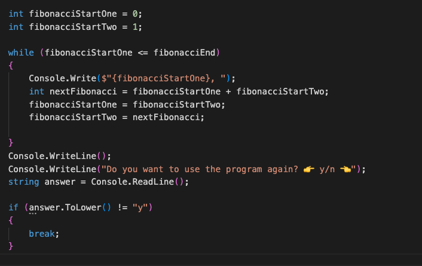

> # Fibonacci-Numbers

------------------------------------------------
### Here the sequence of fibonacci numbers is explained 👆

#### This program accepts a value from the user and outputs the fibonacci numbers up to the value to the console.
------------------------------------------------

The program consists of the following sections. 

1. Input/output section. 

2. The main calculation section of the program.

3. Result

